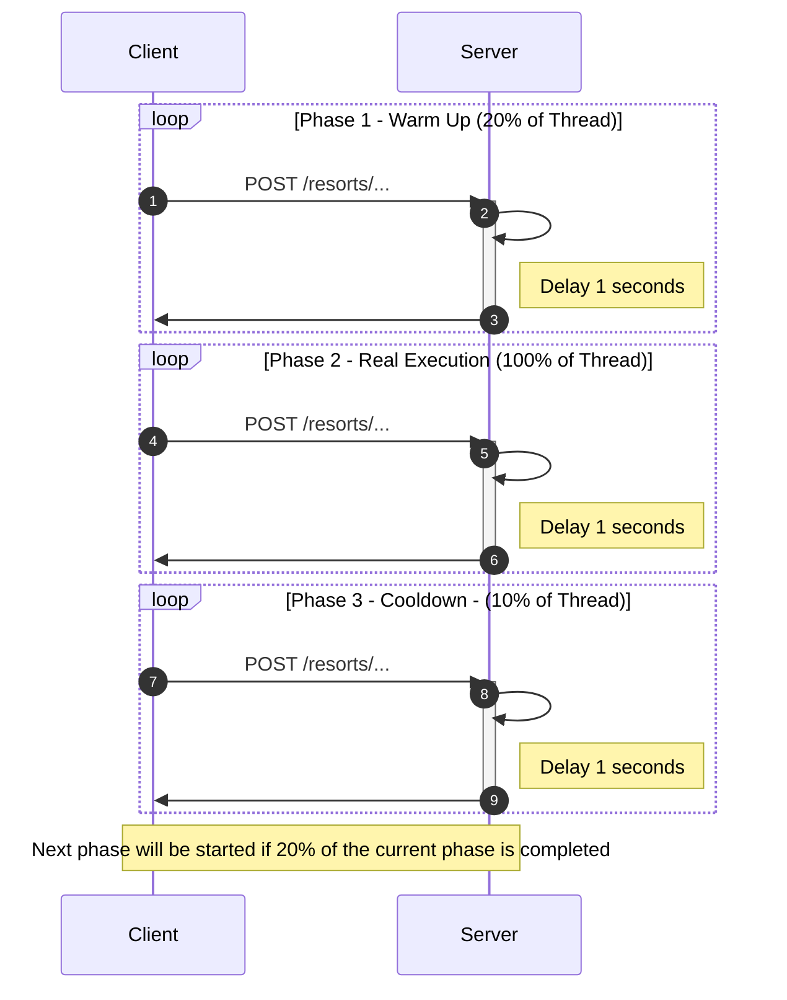

### CS6650 Project Space

```mermaid
sequenceDiagram
    autonumber
    loop Phase 1 - Warm Up (20% of Thread)
        Client->>+Server: POST /resorts/...
        Server->>Server:  
        Note right of Server : Delay 1 seconds
        Server->>-Client: 
    end
        loop Phase 2 - Real Execution (100% of Thread)
        Client->>+Server: POST /resorts/...
        Server->>Server:  
        Note right of Server : Delay 1 seconds
        Server->>-Client: 
    end
        loop Phase 3 - Cooldown  - (10% of Thread)
        Client->>+Server: POST /resorts/...
        Server->>Server:  
        Note right of Server : Delay 1 seconds
        Server->>-Client: 
    end
    note over Client, Server : Next phase will be started if 20% of the current phase is completed
        
```
